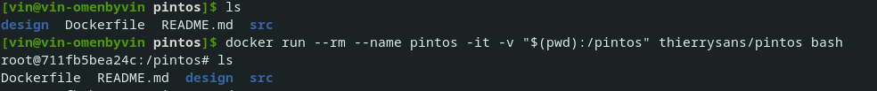
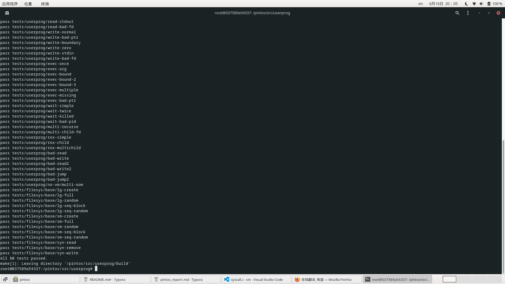

# pintos

## 一、前提背景

本篇文章只是我自己一点点对实验的拙见，具体详细还应该看同学大佬的详细介绍

本文参考:

[大佬轩宝博客](https://www.dengzexuan.top/)

[初始代码（未通过实验版本）](https://github.com/ThierrySans/CSCC69-Pintos)

[通过案例的参考代码](https://github.com/NicoleMayer/pintos_project2)

[自己的代码（其实都是根据大佬们的完整代码en嫖的）](https://github.com/Zhangkaiwen2001/pintos)

下面开始我们的实验吧


## 二、环境配置

因为我看到有很多同伴都不知道环境应该如何配置

下面提供一个不用自己配置直接无脑使用的方法——docker

docker可以使用别人搭建好的环境，然后我们直接使用即可

[docker的下载安装可见此链接](https://yeasy.gitbook.io/docker_practice/install/)

安装好后可以直接在pintos文件夹内打开终端，输入命令

```
docker run --rm --name pintos -it -v "$(pwd):/pintos" thierrysans/pintos bash
```

即可进入由thierrysans教授提供的ubuntu环境，然后就可以愉快的跑代码啦



图为成功进入ubuntu环境的界面

## 三、代码实现

完成了环境配置我们就可以愉快的写代码啦

代码完成主要有下面几个部分

1. [参数传递](###1.参数传递)

2. [系统调用 ](###2.系统调用)

   2.1 [进程控制系统调用](####2.1进程控制系统调用)

   2.2 [文件操作系统调用](####2.2文件操作系统调用)

### 1.参数传递

#### 1.1数据结构和方法

In this task, we mainly modify `process.c` and deal with strings. However, to test the correctness of our algorithm in this task, we must also implement `syscall_write` in `syscall.c`.

在这个模块中，我们主要要修改`process.c`文件。为了验证我们的更改是否正确，我们还需要在`syscall.c`文件中加入`syscall_write`函数

##### 1.1.1数据结构

没有用啥复杂的结构体，只是用到了`string`和`int`

##### 1.1.2方法

- `<process.c>`:

  - 更改`process_execute (const char *file_name)`

    - ```c
      process_execute (const char *file_name) 
      {
        char *fn_copy0, *fn_copy1;
        tid_t tid;
      
      
          /* Make a copy of FILE_NAME.
             Otherwise strtok_r will modify the const char *file_name. */
          fn_copy0 = palloc_get_page(0);//palloc_get_page(0)动态分配了一个内存页
          if (fn_copy0 == NULL)//分配失败
              return TID_ERROR;
      
        /* Make a copy of FILE_NAME.
           Otherwise there's a race between the caller and load(). */
        fn_copy1 = palloc_get_page (0);
        if (fn_copy1 == NULL)
        {
          palloc_free_page(fn_copy0);
          return TID_ERROR;
        }
        //把file_name 复制2份，PGSIZE为页大小
        strlcpy (fn_copy0, file_name, PGSIZE);
        strlcpy (fn_copy1, file_name, PGSIZE);
      
      
        /* Create a new thread to execute FILE_NAME. */
        char *save_ptr;
        char *cmd = strtok_r(fn_copy0, " ", &save_ptr);
        
        tid = thread_create(cmd, PRI_DEFAULT, start_process, fn_copy1);
        palloc_free_page(fn_copy0);
        if (tid == TID_ERROR)
        {
          palloc_free_page (fn_copy1); 
          return tid;
        }
          //后续exec系统调用要求,懒得删了...
          /* Sema down the parent process, waiting for child */
        sema_down(&thread_current()->sema);
        if (!thread_current()->success) return TID_ERROR;//can't create new process thread,return error
      
        return tid;
      }
      
      ```

  - 更改`start_process (void *file_name_)`

    - ```c
      start_process (void *file_name_)
      {
        char *file_name = file_name_;
        struct intr_frame if_;
        bool success;
      
      char *fn_copy=malloc(strlen(file_name)+1);
      strlcpy(fn_copy,file_name,strlen(file_name)+1);
      
        /* Initialize interrupt frame */
        memset (&if_, 0, sizeof if_);
        if_.gs = if_.fs = if_.es = if_.ds = if_.ss = SEL_UDSEG;
        if_.cs = SEL_UCSEG;
        if_.eflags = FLAG_IF | FLAG_MBS;
      
        /*load executable. */
        //此处发生改变，需要传入文件名
        char *token, *save_ptr;
        file_name = strtok_r (file_name, " ", &save_ptr);
        success = load (file_name, &if_.eip, &if_.esp);
        
        if (success)
          {
      
          /* Our implementation for Task 1:
            Calculate the number of parameters and the specification of parameters */
          int argc = 0;
          /* The number of parameters can't be more than 50 in the test case */
          int argv[50];
          for (token = strtok_r (fn_copy, " ", &save_ptr); token != NULL; token = strtok_r (NULL, " ", &save_ptr)){
            if_.esp -= (strlen(token)+1);//栈指针向下移动，留出token+'\0'的大小
            memcpy (if_.esp, token, strlen(token)+1);//token+'\0'复制进去
            argv[argc++] = (int) if_.esp;//存储 参数的地址
          }
          push_argument (&if_.esp, argc, argv);//将参数的地址压入栈
           /* Record the exec_status of the parent thread's success and sema up parent's semaphore */
          thread_current ()->parent->success = true;
          sema_up (&thread_current ()->parent->sema);
          }
        /* Free file_name whether successed or failed. */
        palloc_free_page (file_name);
        free(fn_copy);
        if (!success) 
        {
          thread_current ()->parent->success = false;
          sema_up (&thread_current ()->parent->sema);
          thread_exit ();
        }
          
      
        /* Start the user process by simulating a return from an
           interrupt, implemented by intr_exit (in
           threads/intr-stubs.S).  Because intr_exit takes all of its
           arguments on the stack in the form of a `struct intr_frame',
           we just point the stack pointer (%esp) to our stack frame
           and jump to it. */
        asm volatile ("movl %0, %%esp; jmp intr_exit" : : "g" (&if_) : "memory");
        NOT_REACHED ();
      }
      ```

  - 增加`push_argument(void **esp,int argc, int argv[])`

    - ```c
      /* Our implementation for Task 1:
        Push argument into stack, this method is used in Task 1 Argument Pushing */
      void
      push_argument (void **esp, int argc, int argv[]){
        *esp = (int)*esp & 0xfffffffc;
        *esp -= 4;//四位对齐（word-align）下压uint8_t大小
        *(int *) *esp = 0;
          /*下面这个for循环的意义是：按照argc的大小，循环压入argv数组，这也符合argc和argv之间的关系*/
        for (int i = argc - 1; i >= 0; i--)
        {
          *esp -= 4;
          *(int *) *esp = argv[i];
        }
        *esp -= 4;
        *(int *) *esp = (int) *esp + 4;//压入argv[0]的地址
        *esp -= 4;
        *(int *) *esp = argc;
        *esp -= 4;
        *(int *) *esp = 0;
      }
      ```

  - 更改`process_wait (tid_t child_tid)`

    - ```c
      int
      process_wait (tid_t child_tid UNUSED)
      {
        /* Find the child's ID that the current thread waits for and sema down the child's semaphore */
        struct list *l = &thread_current()->childs;
        struct list_elem *temp;
        temp = list_begin (l);
        struct child *temp2 = NULL;
        while (temp != list_end (l))
        {
          temp2 = list_entry (temp, struct child, child_elem);
          if (temp2->tid == child_tid)
          {
            if (!temp2->isrun)
            {
              temp2->isrun = true;
              sema_down (&temp2->sema);
              break;
            } 
            else 
            {
              return -1;
            }
          }
          temp = list_next (temp);
        }
        if (temp == list_end (l)) {
          return -1;
        }
        list_remove (temp);
        return temp2->store_exit;
      }
      ```

- `<syscall.c>`

  - 添加 `sys_write(int fd, const void *buffer, unsigned size, int* ret)`

    - ```c
      /* Do system write, Do writing in stdout and write in files */
      void 
      sys_write (struct intr_frame* f)
      {
        uint32_t *user_ptr = f->esp;
        check_ptr2 (user_ptr + 7);
        check_ptr2 (*(user_ptr + 6));
        *user_ptr++;
        int temp2 = *user_ptr;
        const char * buffer = (const char *)*(user_ptr+1);
        off_t size = *(user_ptr+2);
        if (temp2 == 1) {
          /* Use putbuf to do testing */
          putbuf(buffer,size);
          f->eax = size;
        }
        else
        {
          /* Write to Files */
          struct thread_file * thread_file_temp = find_file_id (*user_ptr);
          if (thread_file_temp)
          {
            acquire_lock_f ();
            f->eax = file_write (thread_file_temp->file, buffer, size);
            release_lock_f ();
          } 
          else
          {
            f->eax = 0;
          }
        }
      }
      ```

#### 1.2算法

> Since the implementations of  `process_wait (tid_t child_tid)` and `syscall_write(struct intr_frame *f)` are just for testing the algorithm of argument passing. So we won't get into much details about them in this section, we'll discuss it in the task2.
>
> <process.c> :
>
> The function `process_execute` provides `file_name`, which includes command and arguments string. 
>
> First, split the `file_name` to separate the command and arguments. We take this command as the new thread's name and then, pass the arguments to function `start_process`,` load` and `setup_stack`.
>
> After analysing the original pintos code, we know that after `process_execute` creates the thread, user program doesn't execute immediately, it enters the `start_process` and this function invoke `load`, which will allocate memory for user programs. So the time to set up the stack is after `load`.
>
> To set up the stack, we first memcpy the arguments and command name and save their address for future usage. Then add alignment, and `argv`'s address stored before also make sure `argv[argc]` is a null pointer. Next add the address of `argv`, `argc` and finally a `return` address.
>
> We create function `push_argument` to do split the argument by `argv` in the `start_process`.

#### 1.3问题及解决

> When parsing the command line, we use `strtok_r` given by pintos rather than `strtok`. The difference between `strtok` and `strtok_r` is that the latter is threadsafe. The `save_ptr` in `strtok_r` is provided by the caller but  `strtok`  relies on a pointer to remember where it was looking for. Thread may be interrupted at any time, so it's important to be threadsafe.

我们要在`thread.c`和`thread.h`文件中加入文件锁`filesys_lock`

```c
/*Do file lock operation*/
void acquire_lock_f(){
  lock_acquire(&lock_f);
}
void release_lock_f(){
  lock_release(&lock_f);
}
```

#### 1.4小结

> In this task, we split the command name and other arguments and pass them to the function `load` and add them into the stack with correct order. The main purpose of this task is to assign the parameters to a specific stack in a specific order and the logic is clear.

将参数传给特定的堆栈，完成参数传递的功能

### 2.系统调用

#### 2.1进程控制系统调用

##### 2.1.1数据结构和方法

###### 2.1.1.1 数据结构

- `<thread.h>`

  - 创造一个结构体child

    - ```c
      struct child
        {
          tid_t tid;                           /* tid of the thread */
          bool isrun;                          /* whether the child's thread is run successfully */
          struct list_elem child_elem;         /* list of children */
          struct semaphore sema;               /* semaphore to control waiting */
          int store_exit;                      /* the exit status of child thread */
        };
      ```

  - 我们还要向`thread`结构体中加入以下这些属性

    - ```c
      struct list childs;                 /* The list of childs */
      struct child * thread_child;        /* Store the child of this thread */
      int st_exit;                        /* Exit status */
      struct semaphore sema;              /* Control the child process's logic, finish parent waiting for child */
      bool success;                       /* Judge whehter the child's thread execute successfully */
      struct thread* parent;              /* Parent thread of the thread */
      ```

- `<syscall.c>`

  - 创造一个新结构体`syscall`

    - ```c
      struct list files;                  /* List of opened files */
      int file_fd;                        /* File's descriptor */
      struct file * file_owned;           /* The file opened */
      ```

###### 2.1.1.2方法

- `<syscall.c>`

  - 添加`get_user (const uint8_t *uaddr)`

    - ```c
      /* Method in document to handle special situation */
      static int 
      get_user (const uint8_t *uaddr)
      {
        int result;
        asm ("movl $1f, %0; movzbl %1, %0; 1:" : "=&a" (result) : "m" (*uaddr));
        return result;
      }
      ```

  - 修改`syscall_handler (struct intr_frame *f) `

    - ```c
      /* Smplify the code to maintain the code more efficiently */
      static void
      syscall_handler (struct intr_frame *f UNUSED)
      {
        /* For Task2 practice, just add 1 to its first argument, and print its result */
        int * p = f->esp;
        check_ptr2 (p + 1);
        int type = * (int *)f->esp;
        if(type <= 0 || type >= max_syscall){
          exit_special ();
        }
        syscalls[type](f);
      }
      ```

  - 修改`syscall_init (void)`

    - ```c
      void
      syscall_init (void)
      {
        intr_register_int (0x30, 3, INTR_ON, syscall_handler, "syscall");
        /* Our implementation for Task2: initialize halt,exit,exec */
        syscalls[SYS_HALT] = &sys_halt;
        syscalls[SYS_EXIT] = &sys_exit;
        syscalls[SYS_EXEC] = &sys_exec;
      }
      ```

  - 添加`sys_halt (intr_frame* f)`, `sys_exit (intr_frame* f)`, `sys_exec (intr_frame* f)`, `sys_write(intr_frame* f)`, `int sys_wait(intr_frame* f)`函数；

    - ```c
      void 
      sys_halt (struct intr_frame* f)
      {c
        shutdown_power_off();
      }
      ```

    - ```c
      void 
      sys_exit (struct intr_frame* f)
      {
        uint32_t *user_ptr = f->esp;
        check_ptr2 (user_ptr + 1);
        *user_ptr++;
        /* record the exit status of the process */
        thread_current()->st_exit = *user_ptr;
        thread_exit ();
      }
      ```

    - ```c
      void 
      sys_exec (struct intr_frame* f)
      {
        uint32_t *user_ptr = f->esp;
        check_ptr2 (user_ptr + 1);
        check_ptr2 (*(user_ptr + 1));
        *user_ptr++;
        f->eax = process_execute((char*)* user_ptr);
      }
      ```

    - ```c
      void 
      sys_wait (struct intr_frame* f)
      {
        uint32_t *user_ptr = f->esp;
        check_ptr2 (user_ptr + 1);
        *user_ptr++;
        f->eax = process_wait(*user_ptr);
      }
      ```

    - ```c
      void 
      sys_write (struct intr_frame* f)
      {
        uint32_t *user_ptr = f->esp;
        check_ptr2 (user_ptr + 7);
        check_ptr2 (*(user_ptr + 6));
        *user_ptr++;
        int temp2 = *user_ptr;
        const char * buffer = (const char *)*(user_ptr+1);
        off_t size = *(user_ptr+2);
        if (temp2 == 1) {
          /* Use putbuf to do testing */
          putbuf(buffer,size);
          f->eax = size;
        }
        else
        {
          /* Write to Files */
          struct thread_file * thread_file_temp = find_file_id (*user_ptr);
          if (thread_file_temp)
          {
            acquire_lock_f ();
            f->eax = file_write (thread_file_temp->file, buffer, size);
            release_lock_f ();
          } 
          else
          {
            f->eax = 0;
          }
        }
      }
      ```

##### 2.1.2算法

> In this task, we need to finish 4 syscalls
>
> ```C
> SYS_HALT, /* shutdown the system */
> SYS_EXEC, /* start a new program with process_execute() */
> SYS_WAIT, /* wait for a specific child process to exit */
> SYS_PRACTICE /* adds 1 to its first argument, and returns the result */
> ```
>
> `<process.c>`:
>
> In function `process_execute`,  invoke `sema_down` for the current thread to synchronize its execution. If the process is executed successfully, return the child process’s tid; else return `TID_ERROR`.
>
> In function `process_wait`, we'll check if `child_tid` exists in  `thread_current()->childs` . If not this function will return -1, else we'll check if the child has been waited before, since the document stipulates that a child should only been waited for at most once. If it has been waited before, return -1, else set the waiting flag true(success). After checking, we down the semaphore `sema` to block the process until the child terminates, Finally we remove the child process from `childs` and return its `store_exit`.
>
> `<syscall.c>`:
>
> we have a function `syscall_handler` with switch-case to execute corresponding code. The system call type is read from the user process’s stack. However, since they are in the user process's virtual address space, we should check whether the address is pointed to a valid address before executing system calls. The specific verification includes check if the address is below `PHYS_BASE`, if the address is mapped, or if it is null. If the address is invalid, then we need to free the memory page and release any locks or semaphores from this process before exiting. 
>
> **halt**
>
> Implemented by function `sys_halt (intr_frame* f)`, just call function `shutdown_power_off`.
>
> **exec**
>
> Implemented by function `sys_exec (intr_frame* f)`, first to check if the file referred by `file_name` is valid (whether the pointer to memeory address, page and content of page are valid). If it is invalid, return -1, else we call function `process_execute (const char *file_name)`.
>
> **wait** 
>
> Implemented by function `sys_wait(pid_t pid)`, first check if the argument it passed (the pid) is valid. If it is invalid, return -1, else we call function `process_wait (tid_t child_tid)` implemented in task 1.
>
> **practice**
>
> The practice syscall just adds 1 to its first argument `argv[0]`, and returns the result 

`sema_up()`和`sema_down()`类似于`signal()`和`wait()`

##### 2.1.3问题及解决

> In the process of execution of process, execute will return -1 if the process fails, it can't return. To solve this, we add `success` to struct `thread` to record whether the thread exectue successfully. What' more, we use struct thread `parent` to get its parent and set its status according to the result of loading. It's a good design to record child's executing result in parent instead of child. Last but not least, we use semaphore to realize "parent" waits for "child". When a child process is created, it will down `sema` to block the parent. When the child finish, it will up `sema` to wake up his parent.  
>
> In the process of wating of process(we realize the waiting process by semaphore), when a "parent" need to wait his "child", `sema_down` is called to block the parent. And when the "child" finishes, the "parent" will wake up.

在进程的执行过程中，如果进程失败，execute将返回-1，不能返回。为了解决这个问题，我们在`struct thread `中添加`success`来记录线程是否成功执行。

在等待进程的过程中(通过信号量来实现等待进程)，当一个“父”需要等待他的“子”时，调用`sema_down`来阻塞父进程。当“子”完成时，“父”将被唤醒。

##### 2.1.4小结

> In this task, we finish three kernel system calls and one for practice. To achieve the goal, we create a new structure named `child` and add some atrributes to the struct `thread`. Semaphores are used in this task to prevent race condition. What's more, we store a thread's parent for it and such kind of design make us more eficient to find parent thread (we will change the status of parent more quickly).

使用信号量来防止出现竞争情况。更重要的是，我们为它存储了一个线程的父线程，这样的设计可以更有效地找到父线程(我们将更快地改变父线程的状态)。

#### 2.2文件操作系统调用

##### 2.2.1数据结构和方法

###### 2.2.1.1数据结构

- `<thread.h>`

  - 向`thread`结构体中新加一些属性

    - ```c
      struct list files; /* the list of opened files */
      int file_fd; /* File's number thread has */
      struct file * file_owned; /* the file opened */
      ```

- `<syscall.h>`

  - 创建一个新结构体`process_file`

    - ```c
      struct thread_file{
          int fd;
          struct file* file;
          struct list_elem file_elem;
      };
      ```

###### 2.2.1.2方法

- `<syscall.c>`

  - 修改`syscall_handler (struct intr_frame *)`

    - ```c
      /* Smplify the code to maintain the code more efficiently */
      static void
      syscall_handler (struct intr_frame *f UNUSED)
      {
        /* For Task2 practice, just add 1 to its first argument, and print its result */
        int * p = f->esp;
        check_ptr2 (p + 1);
        int type = * (int *)f->esp;
        if(type <= 0 || type >= max_syscall){
          exit_special ();
        }
        syscalls[type](f);
      }
      ```

  - 修改`syscall_init (void)`

    - ```c
      void
      syscall_init (void)
      {
        intr_register_int (0x30, 3, INTR_ON, syscall_handler, "syscall");
        /* Our implementation for Task2: initialize halt,exit,exec */
        syscalls[SYS_HALT] = &sys_halt;
        syscalls[SYS_EXIT] = &sys_exit;
        syscalls[SYS_EXEC] = &sys_exec;
        /* Our implementation for Task3: initialize create, remove, open, filesize, read, write, seek, tell, and close */
        syscalls[SYS_WAIT] = &sys_wait;
        syscalls[SYS_CREATE] = &sys_create;
        syscalls[SYS_REMOVE] = &sys_remove;
        syscalls[SYS_OPEN] = &sys_open;
        syscalls[SYS_WRITE] = &sys_write;
        syscalls[SYS_SEEK] = &sys_seek;
        syscalls[SYS_TELL] = &sys_tell;
        syscalls[SYS_CLOSE] =&sys_close;
        syscalls[SYS_READ] = &sys_read;
        syscalls[SYS_FILESIZE] = &sys_filesize;
      }
      ```

  - 新加`syscall`函数

    - ```c
      void sys_create(struct intr_frame* f); /* syscall create */
      void sys_remove(struct intr_frame* f); /* syscall remove */
      void sys_open(struct intr_frame* f);/* syscall open */
      void sys_wait(struct intr_frame* f); /*syscall wait */
      void sys_filesize(struct intr_frame* f);/* syscall filesize */
      void sys_read(struct intr_frame* f);  /* syscall read */
      void sys_write(struct intr_frame* f); /* syscall write */
      void sys_seek(struct intr_frame* f); /* syscall seek */
      void sys_tell(struct intr_frame* f); /* syscall tell */
      void sys_close(struct intr_frame* f); /* syscall close */
      ```

  - 新加`is_valid_pointer(void* esp,uint8_t argc)`函数

    - ```c
      /* Check is the user pointer is valid */
      bool 
      is_valid_pointer (void* esp,uint8_t argc){
        for (uint8_t i = 0; i < argc; ++i)
        {
          if((!is_user_vaddr (esp)) || 
            (pagedir_get_page (thread_current()->pagedir, esp)==NULL)){
            return false;
          }
        }
        return true;
      }
      ```

  - 新加`find_file_id(int file_id)`函数

    - ```
      /* Find file by the file's ID */
      struct thread_file * 
      find_file_id (int file_id)
      {
        struct list_elem *e;
        struct thread_file * thread_file_temp = NULL;
        struct list *files = &thread_current ()->files;
        for (e = list_begin (files); e != list_end (files); e = list_next (e)){
          thread_file_temp = list_entry (e, struct thread_file, file_elem);
          if (file_id == thread_file_temp->fd)
            return thread_file_temp;
        }
        return false;
      }
      ```

  - 新加`check_ptr2(const void *vaddr)`函数

    - ```
      /* New method to check the address and pages to pass test sc-bad-boundary2, execute */
      void * 
      check_ptr2(const void *vaddr)
      { 
        /* Judge address */
        if (!is_user_vaddr(vaddr))
        {
          exit_special ();
        }
        /* Judge the page */
        void *ptr = pagedir_get_page (thread_current()->pagedir, vaddr);
        if (!ptr)
        {
          exit_special ();
        }
        /* Judge the content of page */
        uint8_t *check_byteptr = (uint8_t *) vaddr;
        for (uint8_t i = 0; i < 4; i++) 
        {
          if (get_user(check_byteptr + i) == -1)
          {
            exit_special ();
          }
        }
      
        return ptr;
      }
      ```

- `<thread.c>` && `<thread.h>`

  * 在`thread.h>`中新建一个`static struct lock `确保线程的安全性

    - ```c
      /*Use a lock to lock process when do file operation*/
      static struct lock lock_f;
      ```

  * 在`<thread.c>` 加入关于文件锁的函数

    - ```
      void 
      acquire_lock_f ()
      {
        lock_acquire(&lock_f);
      }
      
      void 
      release_lock_f ()
      {
        lock_release(&lock_f);
      }
      ```

  * 在`<thread.c>` 加入一些初始化信息函数（可以参照给的源码对比查询）

##### 2.2.2算法

> In this task, we need to implement another 9 syscalls concerning file operation  syscalls: create, remove, open, filesize, read, write, seek, tell, and close. When a user program is running, we must ensure that nobody can modify its executable file on the disk. For this task, we use a global lock to ensure the file syscalls is thread safe. When every syscall is called, it must acquire lock and after then, release the lock.  
>
> Besides, the filesystem of Pintos is not thread-safe, file operation syscalls cannot call multiple filesystem functions concurrently. To ensure this, we add a new variable `file_fd` into struct `thread` to keep the file desciptor larger than `STDIN_FILENO` and `STDOUT_FILENO`, `file_owned` is to keep a thread’s opened files.
>
> The function `syscall_handler` will determine which kind of syscall function to execute. All arguments are already in the stack when a user program invoke a syscall. So, we just need to get the parameter from the stack. Each file syscalls will call the corresponding functions in the file system library in `filesys.c` after it acquires global file system lock, this lock will be released at last.
>
> The function `syscall_init (void)` will initialize `syscalls` to store the function of syscalls in this task.
>
> The function  `is_valid_pointer(void* esp,uint8_t argc)` is used to do unknown bugs in test `bad-read`. This function is just used to check whether the memory is valid and it is just used in `sys_read`
>
> The function `special_eixt` is used to pass the special test which have invalid memory,page and wrong content of page. We will kill the process and exit with -1 by `printf`.
>
> The function `check_ptr2` is used to check whether there is some mistakes like invalid memory, page and wrong content of page for each syscall.
>
> **create**
>
> Implemented by function `sys_create(struct intr_frame* f)`, just call function `filesys_create` and acquire lock by `acquire_lock_f()`, release it after finishing by `release_lock_f()`. This lock process will be used in other filesystem operation in the following methods.
>
> **remove**
>
> Implemented by function `sys_remove(struct intr_frame* f)`, just call function `filesys_remove (const char *name)`.
>
> **open**
>
> Implemented by function `sys_open(struct intr_frame* f)`,fisrt we need to open the file first by function `filesys_open (const char *name)`. Then we need to push the file with structure `thread_file` to the thread's opened file's list `files`.
>
> **write**
>
> Implemented by function `sys_write(struct intr_frame* f)`, first we need to judge whether we will write to stdout or files. If it will be written to stdout, we use function `putbuf (const char *buffer, size_t n)` to finish it. If it will be written to  files, first we find the file by id `find_file_id(int file_id)` in current thread, then do write operation by `file_write (struct file *file, const void *buffer, off_t size) `.
>
> **seek**
>
> Implemented by function `sys_seek(struct intr_frame* f)`, just call function `file_seek (struct file *file, off_t new_pos)`.
>
> **tell**
>
> Implemented by function `sys_tell(struct intr_frame* f)`, first find the file from `find_file_id(int file_id)`. Then call function `file_tell (struct file *file) ` to do syscall tell.
>
> **close**
>
> Implemented by function `sys_close(struct intr_frame* f)`, first find the file from `find_file_id(int file_id)`. Then call function `file_close (struct file *file) ` to do syscall close. Finally, we remove the file in the thread's list and free the file.
>
> **filesize**
>
> Implemented by function `sys_filesize(struct intr_frame* f)`, first find the file from `find_file_id(int file_id)`. Then call function `file_length (struct file *file) ` to do syscall filesize.

##### 2.2.3问题和解决

> All the file operations are protected by the global file system lock, which can prevent I/O on the same fd at the same time. First, we'll check whether the current thread is holding the global lock `lock_f` . If so, we release it. Then we have to close all the file the current thread opens and free all its child. Also, we disable the interruption, when we go through `thread_current()->parent->childs` or `thread_current()->files`, to prevent unpredictable error or race condition in context switch. So they will not cause race conditions. 

对文件进行上锁进行保护，并采用禁止中断的方式确保上下文切换时出现错误。

##### 2.2.4小结

在本次任务中，我们创建了一个名为' thread_file '的新结构体，并向' thread '结构体添加了一些属性。我们对文件操作进行上锁，以防止出现竞争状态。更重要的是，一些特殊情况，如无效的内存，页面和文件已经考虑通过' exit_special '杀死进程。

## 四 、完结撒花

本文可能还有部分讲的不是很细致，如果有问题可以拿源码进行比对查看错误，

一定要细心查看是否存在函数定义顺序问题（被这个弄了好多次，c语言函数最好在开头先定义好）

全pass图收官



**最后祝大家都实验成功！**

